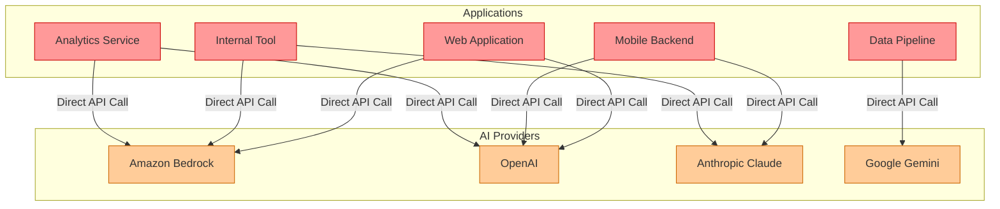

# Diagram: AI Integration Without a Gateway

This diagram illustrates the anti-pattern — applications calling AI providers directly.

Each application manages its own credentials, handles its own retry logic, implements its own cost tracking, and is tightly coupled to a specific provider. This approach does not scale in an enterprise environment.

## Problems With This Pattern

| Problem | Impact |
|---------|--------|
| Credentials scattered across all applications | Security risk — no central rotation or audit |
| No unified cost tracking | AI spend is invisible until the bill arrives |
| No governance | Any application can call any model with no controls |
| Tight vendor coupling | Switching providers requires changes in every application |
| No observability | No unified view of AI traffic, latency, or errors |
| Duplicated retry and error handling | Inconsistent behavior across the estate |
| No rate limiting | A single rogue application can exhaust quotas |

## Next

See [02-with-ai-gateway.md](02-with-ai-gateway.md) for the corrected architecture.
