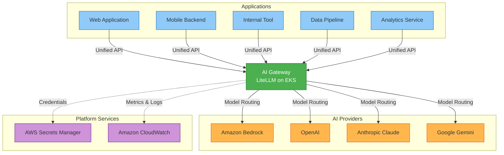

# Diagram: AI Integration With a Gateway

This diagram illustrates the correct enterprise pattern — all applications route AI requests through a centralized AI Gateway.

The gateway is the single control point for model access, governance, cost attribution, and observability. Applications are decoupled from providers and are not aware of which model fulfills their request.

## Benefits of This Pattern

| Capability | How the Gateway Provides It |
|------------|----------------------------|
| Unified API | Applications use a single OpenAI-compatible endpoint |
| Credential management | Secrets stored centrally in AWS Secrets Manager |
| Cost attribution | Token usage tracked per application, per model |
| Governance | Model access controlled by routing policy |
| Observability | All traffic flows through a single observable layer |
| Vendor abstraction | Swap providers without changing application code |
| Rate limiting | Enforced at the gateway, not per application |

## Next

See [03-enterprise-ai-gateway-architecture.md](03-enterprise-ai-gateway-architecture.md) for the full production architecture.
